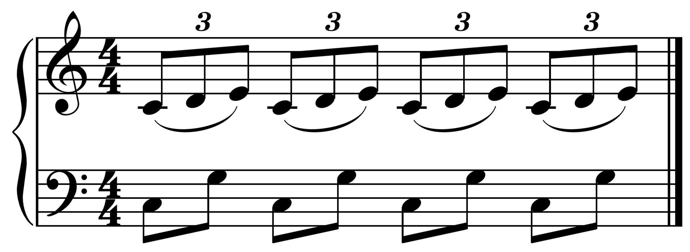

The resulting Faustian bargain between a software developer that expresses even a modicum of interest in honing soft skills, and their pragmatic manager, oft leads a variety of interesting situations. As with many fruitful endeavors, working in the service of a summer, capital "I," Intern forces a re-prioritization of one's responsibilities, introspection over that mentor's soon-to-be-harnessed body of knowledge, and a commitment of a large portion of time that may not immediately yield obvious results. 

After spending a handful of Summers doing just that, and referring mainly to my mentorship of one very talented [Shravan Jambukesan](https://www.shravanj.com/) within Charles Schwab during the 2019 season, I'd distill some quick pieces of personal insight into the following...

## Polyrhythms of work

At the intersection of keeping things fresh for said Intern and emulating what they can expect from the day-to-day of a developer, having multiple opportunities for work and learning ongoing at any point in time has easily been the most effective in bearing fruit. 

For the aforementioned tenure at Charles Schwab, that began with me formulating some high-level goals that boiled down to the hands-on work the Intern would tackle, e.g., "Shravan is a Computer Science undergrad, in classes no different than what were offered at my university during my undergrad only a few years back, which I know for a fact convey little to nothing about 'clean code' and its components," which leads to "These are important concepts that have lots of areas for exploration, and can turn into solid work for a large slice of this summer," which ultimately fed into a lesson plan. That plan covered the usual suspects: unit, component and integration testing in both a new and legacy solution, code coverage and related metrics (and their shortcomings), development driven by those testing concepts we've just covered, etc., all in service of some guided, hands-on work that was a sustainable source of autodidacticism over a period of time.

However, the power in the above was only realized when pairing this work alongside other projects of varying skill-set utilizations. Think of non-technical research projects within the problem domain, or minor internal speaking engagements with the team over what they've learned to strengthen those presentation muscles, or better yet, having their work feed into an even bigger project that taps into all of the above to really deliver on a solid summer experience, which brings me to my next point:

## Ownership

_tbd_
